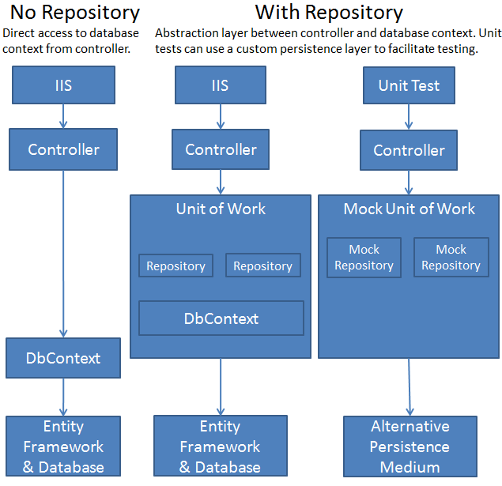

<!-- section start -->

<!-- attr: {id: 'title', class: 'slide-title', hasScriptWrapper: true} -->

# Repository Pattern
## Repositories, Unit of Work, Magic Unicorns
<div class="signature">
    <p class="signature-course">Databases</p>
    <p class="signature-initiative">Telerik Software Academy</p>
    <a href="http://academy.telerik.com" class="signature-link">http://academy.telerik.com</a>
</div>

<!--  -->

<!-- section start -->
<!-- attr: {id: 'table-of-contents'} -->
# Table of Contents
* Definitions
* Pros and Cons of Repository Pattern
* Repository Pattern
* Unit Of Work

<!-- section start -->
<!-- attr: {id: '', class: 'slide-section', showInPresentation:true} -->
<!-- # Definitions -->

<!-- attr: { hasScriptWrapper:true } -->
# What is repository
*  A Repository mediates between the domain and data mapping layers, acting like an **in-memory** domain object collection.
    - Martin Fowler

<!-- attr: { hasScriptWrapper:true } -->
# What is repository
<!--  -->

<!-- section start -->
<!-- attr: {id: '', class: 'slide-section', showInPresentation:true} -->
<!-- # Pros and Cons of Repository Pattern -->

<!-- attr: { hasScriptWrapper:true } -->
# Pros
- Minimizes duplicate query logic
- Decoupling from ORM framework
    - But why you should ever change it?
<br />
<br />
<br />
<br />
<br />
<br />
    - You can test all kinds of ORM frameworks
- Your code is testable once in repository

<!--  -->

<!-- attr: { hasScriptWrapper:true } -->
# Example
- DbContext in the house

```cs
public UsersController(StudentSystemDbContext dbContext)
    {
        var assistants = dbContext.Students
            .Where(a => a.IsAssistant)
            .OrderBy(a => a.LastName)
            .Take(10);
    }
```

- Repository - reusable

```cs
public UsersController(IStudentRepository students)
    {
        var assistants = students
            .GetTop10Assistants(string filter);
    }
```

<!-- attr: { hasScriptWrapper:true } -->
# Example
- What a repository should hold
    - Only **in-memory** data

```cs
Add(obj)
Remove(obj)
Get(id)
GetAll()
Find(predicate)
```

- You should not return Queryable collections
    - You are duplicating EF 

<!-- attr: { hasScriptWrapper:true } -->
# Cons
- Let's look at Entity Framework
<br />
<br />
<br />
<br />
<br />
- Do we see something in common with our repository

<!--  -->
- If you use the repository you should load a lot of data in-memory and then query it. This could be a problem but there are solutions to that.

<!-- section start -->
<!-- attr: {id: '', class: 'slide-section', showInPresentation:true} -->
<!-- # Repository Pattern in EF
## The right one :) -->

<!-- attr: { hasScriptWrapper:true } -->
# Repositories
- You should implement an interface repository
- And you should implement a generic repository
<br />
<br />
<br />
<br />
- You could register this into an IoC container or pass it manually

<!--  -->

<!-- attr: { hasScriptWrapper:true } -->
# Repository exmaple
- Returning **in-memory** collections not IQueryable

```cs
public interface IRepository<T>
        where T : class
    {
        IEnumerable<T> All();
        IEnumerable<T> Find(Expression<Func<T,bool>> filter)
        T GetById(object id);
        void Add(T entity);
        void Update(T entity);
        void Delete(T entity);
        void Delete(object id);
    }
```

<!-- attr: { hasScriptWrapper:true } -->
# Repository exmaple
- With this repository you could end up loading all the columns 
- This is not an issue because you could filter them on the list
- YAGNI principle for the win
- You could add expressions for Select, OrderBy and Where in the repository


<!-- attr: { hasScriptWrapper:true } -->
# Repository IQueryable
- Why not use IQueryable?
    - This is not a repository
    - You are coupled with a Database 
    - Leaky abstraction
- What about AsQueryable()
    - For in-memory collections this does not Work

<!-- attr: { hasScriptWrapper:true } -->
# Repository IQueryable
- Example of a repository with IQueryables

```cs
public interface IRepository<T>
        where T : class
    {
        // L2E will not work in some cases
        IQueryable<T> All();

        T GetById(object id);
        void Add(T entity);
        void Update(T entity);
        void Delete(T entity);
        void Delete(object id);
    }
```

<!-- attr: { hasScriptWrapper:true } -->
# Repository IQueryable
- This method resolve is not Implemented in L2E

```cs
public interface IRepository<T>
        where T : class
    {
        IQueryable<T> All()
    
```

- The solution is to use a property instead if a method

```cs
public interface IRepository<T>
        where T : class
    {
        IQueryable<T> All { get; }
    }
```

<!-- attr: { hasScriptWrapper:true } -->
# Usage of the repository
- This example is missing something

```cs
[HttpPost]
public ActionResult AddStudent(Student studentModel)
{
    this.studentsRepo.Add(studentToAdd);

    return this.Redirect("Details/" + studentToAdd.Id);
}
```

<div class="fragment balloon" style="font-size:70%;">SaveChanges() method!</div>  
<div class="fragment balloon" style="font-size:70%;">But where is SaveChanges() method!</div>  
<div class="fragment" style="position: absolute; left:65%; bottom: 10%; width:30%;"></div>  


<!-- attr: { hasScriptWrapper:true } -->
# SaveChanges()
- Let's again look at the the classes in EF
<br />
<br />
<br />
<br />
<br />
- The method is present in the DbContext class
- We could use it in our code. But where?

<!--  -->
<!--  -->

<!-- attr: { hasScriptWrapper:true } -->
# SaveChanges()

- IRepository&lt;T>

```cs
public interface IRepository<T>
        where T : class
    {
        IQueryable<T> All();
        T GetById(object id);
        void Add(T entity);
        void Update(T entity);
        void Delete(T entity);
        void Delete(object id);
        int SaveChanges();
    }
```

<!-- attr: { hasScriptWrapper:true, style:'font-size:0.9em' } -->
# SaveChanges() in Repository
## Wrong!

- GenericRepository&lt;T>

```cs
public class EfGenericRepository<T> : IRepository<T>
        where T : class
{
    public EfGenericRepository(DbContext context)
    {
        if (context == null)
        {
            throw new ArgumentException("Message")
        }
        this.Context = context;
        this.DbSet = this.Context.Set<T>();
    }
    public int SaveChanges()
    {
        return this.Context.SaveChanges();
    }
}
```


<!-- attr: { class:'slide-section table-of-contents',showInPresentation:true } -->
<!-- # SaveChanges() -->
## [Demo]()

<!-- section start -->
<!-- attr: {id: '', class: 'slide-section', showInPresentation:true} -->
<!-- # Unit of work
## Take control of changes -->

<!-- attr: {hasScriptWrapper:true} -->
# Definition

A Unit of Work can be defined as a collection of operations that succeed or fail as a single unit.

<!--  -->

<!-- attr: {hasScriptWrapper:true} -->
# Definition again

Maintains a list of objects affected by a business transaction and coordinates the writing out of changes and the resolution of concurrency problems.

- Martin Fowler

<!-- attr: {hasScriptWrapper:true} -->
# Why make another layer
- The DbContext class in EF is a Unit Of Work itself
- So why do we need to make it again on top of this?
    - Decouples from EF
    - Testablitiy
    - Abstraction
    - Maintainability
- Provide you with single place where changes happen and your code is clear

<!-- attr: {hasScriptWrapper:true} -->


# Unit Of Work
- Create an concrete implementation

```cs
public class UnitOfWork : IUnitOfWork
{
    private IDbContext context;

    public UnitOfWork(IDbContext context)
    {
        if(context == null)
        {
            throw new ArgumentException("Message");
        }
        this.context = context;
    }
    public void Commit()
    {
        this.context.SaveChanges();
    }
}
```
<!--  -->

<!-- attr: {hasScriptWrapper:true} -->
# Unit of work
- You could use unit of work as service locator
    - All the repositories are instantiated in it as properties

```cs
public interface IUnitOfWork
{
    IUserRepository Contests { get; }

    ITaskRepository Tasks { get; }

    // and so on...
}
```

<!-- attr: {hasScriptWrapper:true} -->
# Disposing the context
- When we should dispose DbContext
    - The short answer is - Never

<div class="fragment"></div>

<div class="fragment">
- By default DbContext automatically<br /> manages the connection for you <br />
- DbContext itself is IDisposable<br /> but it is needed in some special cases
</div>

<!-- attr: {hasScriptWrapper:true} -->
# Unit Of Work - IDisposable
- You could make your unit of work IDisposable object
- Provide more control over the DbContext through your Unit Of Work
- Another thing is to provide some syntactic sugar with using block

```cs
public interface IUnitOfWork : IDisposable
{
    void Commit();
}
```


<!-- attr: { class:'slide-section table-of-contents',showInPresentation:true } -->
<!-- # Unit Of Work -->
## [Demo]()


<!-- section start -->
<!-- attr: {id: 'questions', class: 'slide-section', hasScriptWrapper:true} -->
# Questions
<!--  -->
